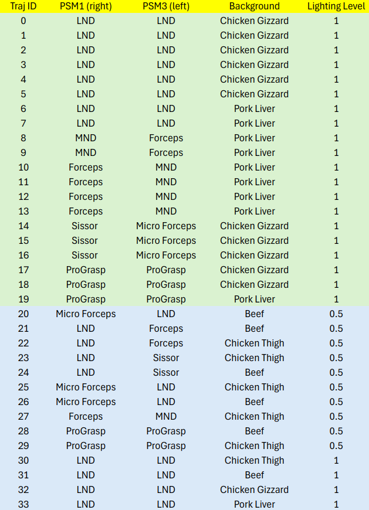

# SurgPose: a Dataset for Articulated Robotic Surgical Tool Pose Estimation and Tracking (ICRA'25)

[](https://arxiv.org/abs/2502.11534)
[](https://zenodo.org/badge/latestdoi/{github_id})

## Dataset Description
The SurgPose dataset can be accessed [here]().

### Dataset Structure
There are 34 folders (000000-000033) of data. Data of each folder has a structure like:

    .
    ├── 000000                  
    │   ├── keypoints_left.yaml 
    │   ├── keypoints_right.yaml  
    │   ├── bbox_left.json
    │   ├── bbox_right.json
    │   ├── api_cp_data.yaml
    │   ├── api_jp_data.yaml
    │   ├── StereoCalibrationDVRK.ini                
    │   ├── regular
    │   │    ├── left_video.mp4
    │   │    └── right_video.mp4
    │   └── green (optional)                 
    │        ├── left_video.mp4
    │        └── right_video.mp4
    └──...
### Keypoints
The `keypoints_left.yaml` and `keypoints_right.yaml` include the keypoint labels of the binocular video. There are a few inaccurate keypoint labels. These inaccuracy are mainly due to system delays (in the first frame). The key point definition are illustrated in the figure below. Please note that we provide 1-5 (PSM1) and 8-12 (PSM3) keypoint labels for all frames, but keypoints 6, 7, 13, and 14 for only a few frames.
<p align="center">

</p>

### Forward Kinematics & Joint States from dVRK
The forward kinematics `api_cp_data.yaml` and joint states `api_jp_data.yaml` are obtained using dVRK API `measured_cp()` and `measured_jp()`. These raw data need to be compensated, but the relative value is decent.

### Bounding Boxes and Segmentation Masks
The bounding boxes of left and right videos are `bbox_left.json` and `bbox_right.json`. Bounding boxes and segmentation masks are assisted annotations for surgical instrument pose estimation. Similar to human pose estimation, top-down methods require bounding box as a part of the input. We provide a reference bounding box label derived from the instance-level SAM 2 segmentation mask (Please note that there are some wrong bounding boxes due to the segmentation error). You can also generate more compact bounding boxes from the keypoint ground truth or use any object detection algorithm if needed.

### Visualizaion
After downloading the dataset, you may use `utils/video2images.py` to extract images from a video. <b>The FPS MUST be 30</b> to align with keypoint labels. Run `python utils/video2images.py ---video-path [path to the video] --fps 30 --output-dir [path to save images]` to extract images.

1. Keypoints: You may use `kps_vis.py` to visualize keypoints. Run `python kps_vis.py --kpt_path [path to .yaml keypoint files] --frame_dir [path to the folder of frames] --output_dir [path you want to save the frames with keypoints]` to save images with keypoint labels.
2. Bounding Boxes: You may use `bbox_vis.py` to visualize bounding boxes. Run `python bbox_vis.py --bbox_path [path to .json bbox files] --frame_dir [path to the folder of frames] --output_dir [path you want to save the frames with bounding boxes]` to save images with bbox labels.

### Data Distribution Details  
The figure below shows some detailed information of the dataset. We define trajectory 0-19 as the training set and 20-33 as the validation set. Feel free to split the dataset according to your requirement.
<p align="center">

</p>

## SAM2 for Keypoints Annotation
We provide `kps_annotation_sam2.py` to generate keypoints annotation files. It is adapted from the official SAM2 code.

1. Configure the environment following the official instructions https://github.com/facebookresearch/sam2.

2. Download the checkpoint (SAM2/SAM2.1) and put it in the `/checkpoints` folder.

3. Change the `ann_config` in the script to the correct information. 

4. For now, you may have to manually get (positive and/or negative) point prompts for each UV paint dot. We consider providing a GUI for easier labeling in the future.

## Stereo Depth Estimation
We provide example code for stereo matching based on [RAFT](https://github.com/princeton-vl/RAFT). 

1. <b>Stereo Camera Calibration:</b> SurgPose includes stereo camera parameters `StereoCalibrationDVRK.ini` deriving from [MATLAB 2024b Stereo Camera Calibration](https://www.mathworks.com/help/vision/ug/using-the-stereo-camera-calibrator-app.html) Application. In `StereoCalibrationDVRK.ini`, k0, k1, k4 refer radial distortion coeffients and k2, k3 infer tangential distortion coeffients.

2. <b>Stereo Matching:</b> Run `python depth_estimator.py -d [path to data, e.g. /SurgPose/000000]`. Note that the original image size of SurgPose is 1400x986. In this example script, to run RAFT, the image size needs to be resized to the multiple of 8, e.g., 640x512. Based on RAFT, not all frames can get very accurate depth. Feel free to try other stereo matching methods with stronger performance.

## Trajectory Generation

1. Define the workspace for PSM1 (right instrument) and/or PSM3 (left instrument).

2. Randomly sample N points in the workspace.

3. Generate smooth and periodic end-effector trajectories passing the N points, based on the Curve Fitting Toolbox and Robotic System Toolbox in MATLAB 2024b. Please be aware that this trajectory only have translation, WITHOUT rotation.

4. For articulations, we use periodic functions (sine and cosine) to define the trajectory of each degree of freedom (shaft rotation, wrist joint, gripper rotation, and gripper open angle). You may need to modify parameters of these functions to fit your system and applications.

5. After above steps, you are good to run code `trajectory_generator.m` in MATLAB.

## Data Collection

SurgPose was collected in the [Robotics and Control Laboratory (RCL)](https://rcl.ece.ubc.ca/) @ UBC. We used da Vinci IS1200 system with the [da Vinci Research Kit](https://github.com/jhu-dvrk) (dVRK). Furture work is to collect extra data for better evaluation in the [Laboratory for Computational Sensing and Robotics (LCSR)](https://lcsr.jhu.edu/) @ JHU. 

After setting up the system, run `python data_collection.py` with the 2.1 version of dVRK.

## Material List
- UV reative paint: [GLO Effex Invisible Transparent UV Reactive Paint](https://www.gloeffex.com/collections/best-sellers/products/transparent-uv-paint-blacklight-uv-reactive-intense-glow-and-effect)
- Black light: [Everbeam 365nm 50W UV LED Black Light](https://www.amazon.ca/dp/B08635F9CX?ref=ppx_yo2ov_dt_b_fed_asin_title&th=1)
- Paint Brush: [Fine Detail Paint Brush](https://www.amazon.ca/dp/B0C57XKQVP?ref=ppx_yo2ov_dt_b_fed_asin_title)
- Paint remover: [Corconess Acetone Nail Polish Remover Pads](https://www.amazon.ca/dp/B0D46FT4DK?ref=ppx_yo2ov_dt_b_fed_asin_title)

## Related Works and Benchmarks 

Here we list a few baselines that can be used for Surgical Instrument Pose Estimation. If you have other methods for SurgPose, please reach out and we will add them here.

1. [DeepLabCut](https://github.com/DeepLabCut/DeepLabCut): There is an example tutorial @[RandyMoore](https://github.com/rwjmoore): [SurgPose performance with deeplabcut](https://github.com/rwjmoore/surgPose_deeplabcut)

2. [YOLO v8](https://docs.ultralytics.com/models/yolov8/): The annotation need to be reformatted to YOLO format.

3. [ViTPose: Simple Vision Transformer Baselines for Human Pose Estimation](https://github.com/ViTAE-Transformer/ViTPose) The annotation need to be reformated to COCO format.

## Acknowledgement
We sincerely appreciate [RAFT](), and [Segment Anything 2](). Many thanks to these fantastic works and their open-sourse contribution!

## Citation
If you feel SurgPose or this codebase is helpful, please consider cite this paper:
```
@article{wu2025surgpose,
  title={SurgPose: a Dataset for Articulated Robotic Surgical Tool Pose Estimation and Tracking},
  author={Wu, Zijian and Schmidt, Adam and Moore, Randy and Zhou, Haoying and Banks, Alexandre and Kazanzides, Peter and Salcudean, Septimiu E},
  journal={arXiv preprint arXiv:2502.11534},
  year={2025}
}
```

## Contact
If you have any issues, feel free to reach out zijianwu@ece.ubc.ca

